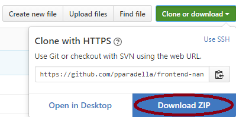

frontend-nanodegree-arcade-game
===============================

Students should use this [rubric](https://review.udacity.com/#!/projects/2696458597/rubric) for self-checking their submission. Make sure the functions you write are **object-oriented** - either class functions (like Player and Enemy) or class prototype functions such as Enemy.prototype.checkCollisions, and that the keyword 'this' is used appropriately within your class and class prototype functions to refer to the object the function is called upon. Also be sure that the **readme.md** file is updated with your instructions on both how to 1. Run and 2. Play your arcade game.

For detailed instructions on how to get started, check out this [guide](https://docs.google.com/document/d/1v01aScPjSWCCWQLIpFqvg3-vXLH2e8_SZQKC8jNO0Dc/pub?embedded=true).

#How to open the game

###Download <br>
You can clone with your git terminal by:
```
$ git clone https://github.com/pparadella/frontend-nanodegree-arcade-game.git
```

Or you can download the zip file and extract.<br>


###Run<br>
After getting the files, inside the main folder open the file called `index.html`.

#How to Play

###Choose your character<br>
The first screen is a character selection screen. Just click in one of them.

###Keys <br>
* `Up Arrow`: Character goes up.
* `Down Arrow`: Character goes down.
* `Left Arrow`: Character goes left.
* `Right Arrow`: Character goes right.

###Objective<br>
In the corner up right you have your score.

 You have to cross the road without crashing with a bug.
Every time you reach the water you gain one in your score. To win you need to get your score up to 6.

But be aware every time you crash with a bug your score decreases by one.
